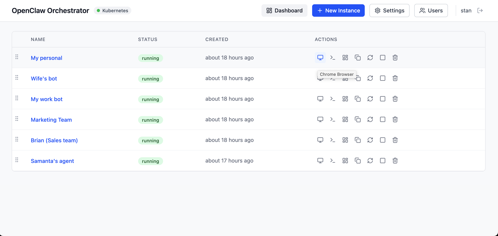
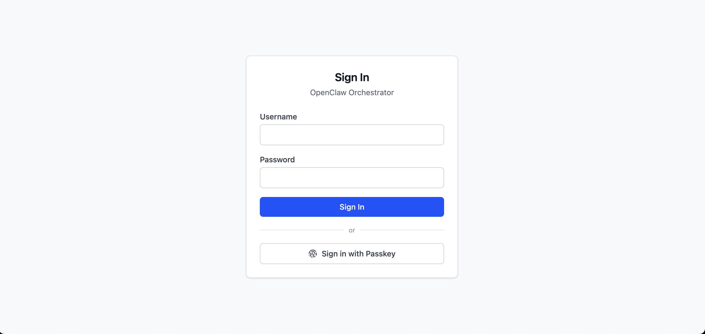

# Claworc — AI Agent Orchestrator for OpenClaw

[OpenClaw](https://openclaw.com) is an open-source AI agent that runs locally, 
connects to any LLM, and autonomously executes tasks using an operating system's tools. 
Claworc makes it safe and simple to run multiple OpenClaw instances across your organization 
from a single web dashboard.

Each instance runs in an isolated container with its own browser, terminal, and persistent storage. 
Claworc proxies all traffic through a single entry point with built-in authentication, 
solving OpenClaw's biggest operational challenges: security, access control, and multi-instance management.

**Use case:** Give every team member their own AI agent, stand up a shared agent for data analysis, or run 
an internal IT support bot — then manage them all from one place.

## What Is an Instance?

An instance is a self-contained AI workspace. When you create one, Claworc spins up an isolated container that includes:

- **An AI agent** powered by the LLM of your choice — Claude, GPT, DeepSeek, or any supported model
- **A full Chrome browser** that the agent operates and you can watch or control live through your own browser
- **A terminal** for command-line operations
- **Persistent storage** for files, browser profiles, and installed packages — survives restarts and redeployments

Instances are fully isolated from each other, each with its own file system. They are monitored by systemd 
and automatically restarted if they crash.

## What You Can Do

- **Create and manage instances** — spin up new agent workspaces, start/stop them, or remove them when done
- **Chat with agents** — send instructions and have a conversation with the AI agent in each instance
- **Watch the browser** — see what the agent is doing in Chrome in real time, or take control yourself
- **Manage files** — browse and manage the files in each instance's workspace
- **View logs** — stream live logs to monitor what's happening inside an instance
- **Configure models and API keys** — set global defaults so you don't have to re-enter API keys for every instance, or 
  override them per instance with different models and keys

## Access Control

Claworc has a multi-user interface with two roles:

- **Admins** can create, configure, and manage all instances
- **Users** have access only to the instances assigned to them

Biometric identification is supported for authentication.

## Deployment

Claworc runs on **Docker** for local or single-server setups, or on **Kubernetes** for production-scale deployments. 
The control plane is a single binary with 20Mb footprint that serves both the web dashboard and the proxy layer 
for instance access. [Read more](docs/install.md)

## Documentation

- [Installation](docs/install.md) - Multiple options
- [Features](docs/features.md) - Feature specifications and user workflows
- [Architecture](docs/architecture.md) - System architecture and design decisions
- [API](docs/api.md) - REST API endpoints and request/response formats
- [Data Model](docs/data-model.md) - Database schema and Kubernetes resource model
- [UI](docs/ui.md) - Frontend pages, components, and interaction patterns

## Coming Soon

- API token usage monitoring
- Skills management

## Open Source

Claworc is fully open source, self-hosted, and free. Contributions are welcome!
